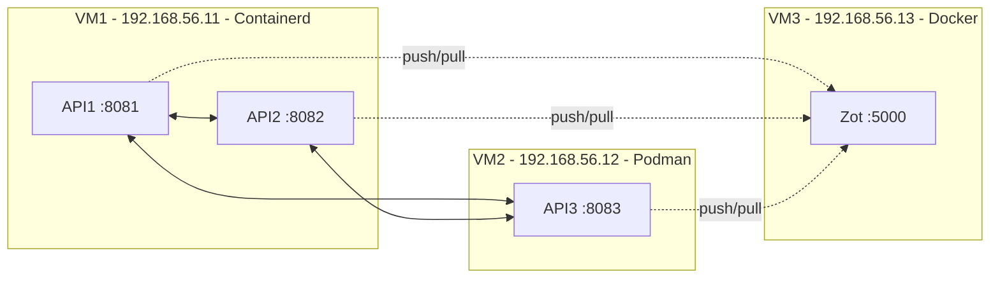

# Proyecto 1 - Sistemas Operativos 1

Proyecto personalizado para el carnet **201801391**. Implementa tres APIs REST en Go, tres imágenes OCI, comunicación cruzada por HTTP y un registro privado Zot, distribuidos de esta forma:

| VM | IP de laboratorio | Runtime | Servicios |
|---|---:|---|---|
| VM1 | `192.168.56.11` | Containerd + nerdctl | API1 (`8081`) y API2 (`8082`) |
| VM2 | `192.168.56.12` | Podman | API3 (`8083`) |
| VM3 | `192.168.56.13` | Docker | Zot (`5000`) |

Los nombres de imagen son `api1-201801391`, `api2-201801391` y `api3-201801391`. Se escriben en minúsculas porque los nombres de repositorio OCI/Docker no admiten mayúsculas.

## Arquitectura



## Validación rápida del código

Con Go 1.21 o posterior:

```powershell
go test ./...
powershell -ExecutionPolicy Bypass -File .\scripts\local-integration-test.ps1
```

La segunda orden compila y levanta temporalmente las tres APIs en Windows, valida tres respuestas `/health` y las seis llamadas cruzadas, y luego detiene solamente los procesos que ella creó.

## Despliegue completo con KVM

La ruta recomendada es Vagrant con el proveedor `vagrant-libvirt`, que crea tres VMs sobre KVM. El procedimiento completo, incluyendo los prerrequisitos del host, está en [docs/GUIA_INSTALACION.md](docs/GUIA_INSTALACION.md).

Resumen de ejecución después de `vagrant up --provider=libvirt`:

```bash
vagrant ssh vm3 -c 'PROJECT_DIR=/proyecto bash /proyecto/scripts/vm3/setup-zot.sh'
vagrant ssh vm1 -c 'bash /proyecto/scripts/vm1/setup-containerd.sh'
vagrant ssh vm1 -c 'PROJECT_DIR=/proyecto bash /proyecto/scripts/vm1/deploy-apis.sh'
vagrant ssh vm2 -c 'bash /proyecto/scripts/vm2/setup-podman.sh'
vagrant ssh vm2 -c 'PROJECT_DIR=/proyecto bash /proyecto/scripts/vm2/deploy-api3.sh'
bash scripts/test-endpoints.sh
```

El orden importa: Zot debe estar disponible antes de hacer `push` y `pull` de las imágenes.

## Endpoints

| API | Ruta | Destino |
|---|---|---|
| API1 | `GET /health` | Estado de API1 |
| API1 | `GET /api1/201801391/call-api2` | `/health` de API2 |
| API1 | `GET /api1/201801391/call-api3` | `/health` de API3 |
| API2 | `GET /health` | Estado de API2 |
| API2 | `GET /api2/201801391/call-api1` | `/health` de API1 |
| API2 | `GET /api2/201801391/call-api3` | `/health` de API3 |
| API3 | `GET /health` | Estado de API3 |
| API3 | `GET /api3/201801391/call-api1` | `/health` de API1 |
| API3 | `GET /api3/201801391/call-api2` | `/health` de API2 |

Ejemplo de `/health`:

```json
{
  "status": "UP",
  "message": "API1 is Ready",
  "timestamp": "2026-08-03T14:30:00Z",
  "VM": "VM1",
  "carnet": "201801391"
}
```

Ejemplo de comunicación correcta:

```json
{
  "apiname": "API3",
  "message": "The API3 located on the VM2 is working",
  "connection": true,
  "carnet": "201801391"
}
```

Si la API destino no responde o su `status` no es `UP`, el mismo endpoint devuelve `connection:false` y el mensaje de error requerido.

## Documentación entregada

- [Manual técnico](docs/MANUAL_TECNICO.md)
- [Manual de usuario](docs/MANUAL_USUARIO.md)
- [Guía de instalación](docs/GUIA_INSTALACION.md)
- [Evidencias funcionales](docs/EVIDENCIAS.md)
- [Resultados de pruebas ejecutadas](docs/RESULTADOS_PRUEBAS.md)
- [Preguntas para la defensa](docs/PREGUNTAS_DEFENSA.md)
- [Auditoría de cumplimiento](docs/AUDITORIA_PDF.md)

## Repositorio solicitado por el enunciado

Las capturas funcionales ya están organizadas en [docs/EVIDENCIAS.md](docs/EVIDENCIAS.md). Crea o renombra el repositorio privado exactamente como `201801391_LAB_SO1_2S2026` y agrega como colaboradores a `JoseLorenzana272` y `KINGR0X`. Esa publicación no se realiza automáticamente para no modificar tu cuenta de GitHub sin autorización.
