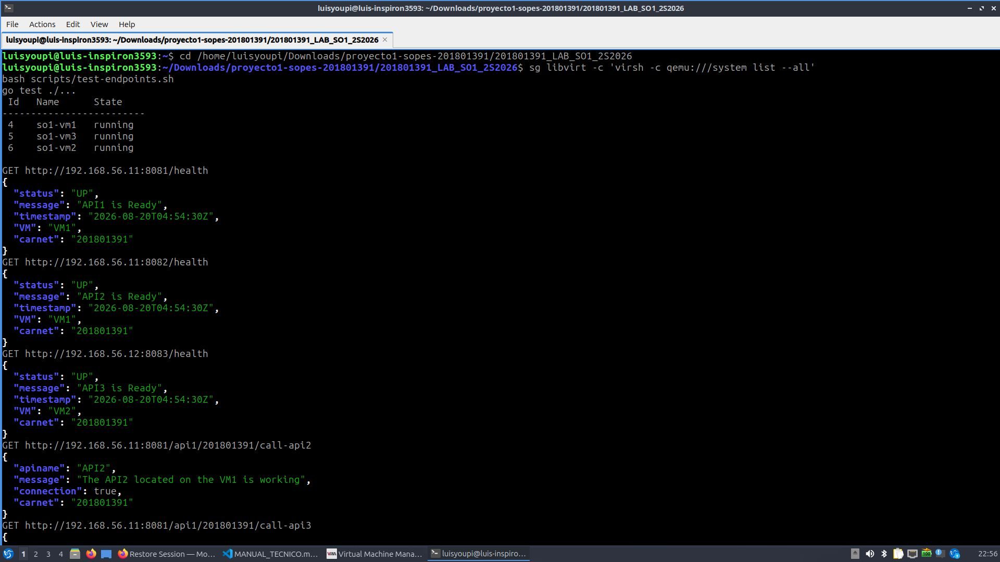
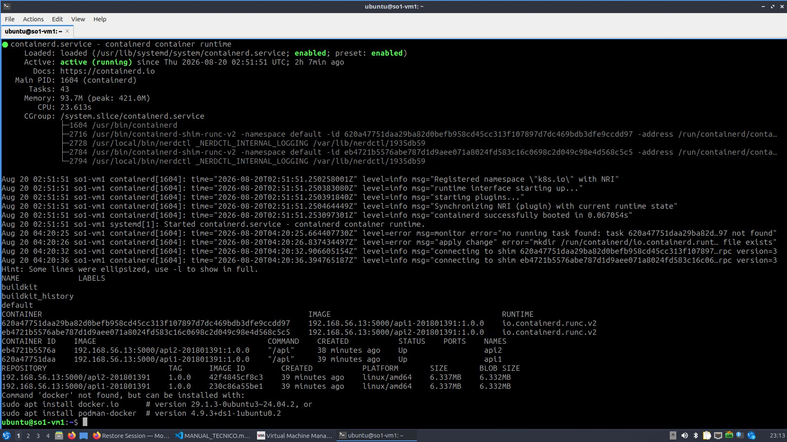
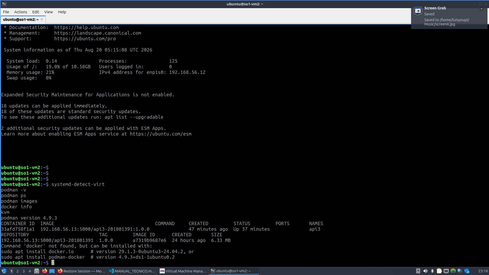
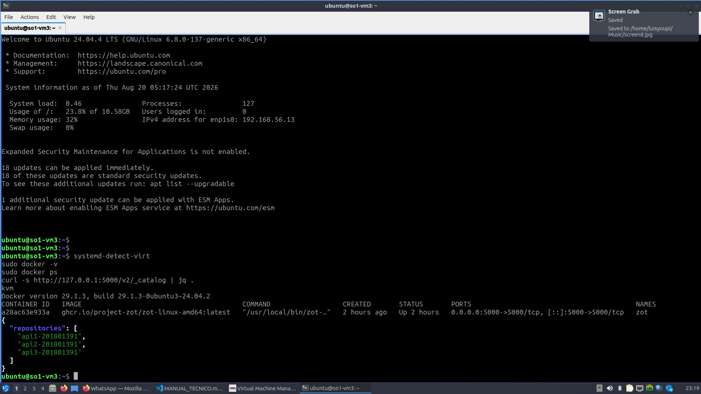
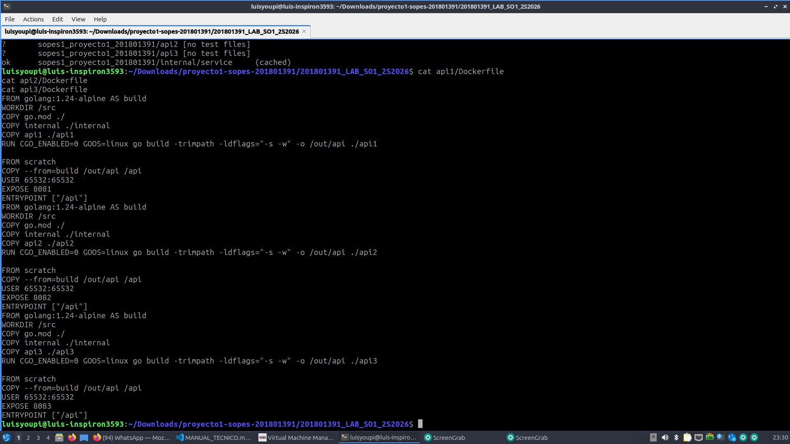

# Evidencias funcionales

Las siguientes capturas fueron obtenidas el 19 de agosto de 2026 durante la ejecución real del laboratorio KVM. Los resultados corresponden al carnet `201801391` y a las direcciones `192.168.56.11`, `192.168.56.12` y `192.168.56.13`.

## Matriz de cumplimiento

| No. | Evidencia solicitada | Archivo | Resultado |
|---:|---|---|---|
| 1 | Tres VMs activas bajo QEMU/KVM | `01-vms-kvm-virt-manager.jpg` | VM1, VM2 y VM3 en estado `Running` |
| 2 | VMs, direcciones y `/health` | `02-vms-y-health.jpg` | Tres VMs y tres respuestas `UP` |
| 3 | Containerd en VM1 | `03-containerd-vm1.jpg` | Servicio activo, API1/API2, imágenes y Docker ausente |
| 4 | Podman en VM2 | `04-podman-vm2.jpg` | API3 activa, imagen de 6.33 MB y Docker ausente |
| 5 | Docker y Zot en VM3 | `05-docker-zot-vm3.jpg` | Docker activo, Zot `Up` y tres repositorios |
| 6 | Salud y comunicación | `06-health-comunicacion-1.jpg` | Tres `/health` y primeras llamadas correctas |
| 7 | Seis llamadas cruzadas | `07-comunicacion-cruzada.jpg` | Respuestas con `connection: true` |
| 8 | Prueba automatizada y catálogo | `08-prueba-final-catalogo.jpg` | Contratos REST y Zot correctos |
| 9 | Manejo de indisponibilidad | `09-error-controlado.jpg` | API3 detenida produce `connection: false` |
| 10 | Recuperación del servicio | `10-recuperacion-api3.jpg` | API3 reiniciada y `/health` en `UP` |
| 11 | Código e imágenes mínimas | `11-pruebas-go-dockerfiles.jpg` | Pruebas Go correctas y tres etapas finales `scratch` |

## 1. Infraestructura KVM

Virtual Machine Manager muestra las tres máquinas activas:


La terminal confirma las tres VMs en ejecución y las respuestas de salud:



## 2. Runtimes por máquina

### VM1: Containerd

Se observa `containerd.service` activo, los namespaces, API1/API2 en ejecución, las imágenes de 6.337 MB y la ausencia de Docker:



### VM2: Podman

Podman 4.9.3 ejecuta API3 de forma rootless. La imagen conserva el nombre requerido y pesa 6.33 MB; Docker no está instalado:



### VM3: Docker y Zot

Docker 29.1.3 ejecuta Zot en el puerto 5000 y el catálogo contiene las tres imágenes personalizadas:



## 3. Endpoints y comunicación cruzada

Los tres endpoints `/health` entregan `UP`, VM y carnet correctos:


Las seis combinaciones de comunicación entre API1, API2 y API3 responden con `connection: true`:


La prueba automatizada finaliza correctamente y Zot lista los tres repositorios:


## 4. Manejo de errores y recuperación

Al detener API3, API1 detecta la indisponibilidad y devuelve el formato de error solicitado:


Después de iniciar API3 nuevamente, `/health` regresa a `UP`:


## 5. Pruebas Go y Dockerfiles

Las pruebas Go finalizan correctamente. Los tres Dockerfiles usan compilación multi-stage y una etapa final `FROM scratch`:



## Comandos de reproducción

```bash
sg libvirt -c 'virsh -c qemu:///system list --all'
bash scripts/test-endpoints.sh
env GOCACHE=/tmp/so1-go-cache go test ./...
env GOCACHE=/tmp/so1-go-cache go vet ./...
```

La prueba negativa se reproduce desde el host con:

```bash
ssh -i ~/.ssh/id_ed25519 ubuntu@192.168.56.12 'podman stop api3'
curl -s http://192.168.56.11:8081/api1/201801391/call-api3 | jq .
ssh -i ~/.ssh/id_ed25519 ubuntu@192.168.56.12 'podman start api3'
curl -s http://192.168.56.12:8083/health | jq .
```
