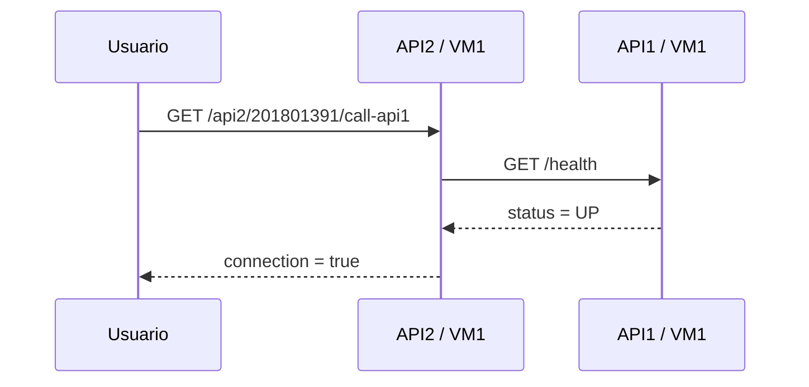

# Manual técnico

## 1. Objetivo

El sistema demuestra virtualización con KVM, ejecución de contenedores mediante tres runtimes diferentes, distribución de imágenes a través de un registro privado Zot y comunicación REST entre servicios desarrollados en Go.

## 2. Topología

La red privada de laboratorio usa `192.168.56.0/24`. VM1 aloja API1 y API2 con Containerd; VM2 aloja API3 con Podman; VM3 aloja Zot con Docker. Los contenedores de las APIs usan la red del host para evitar capas NAT distintas entre runtimes y conservar rutas directas entre las VMs.



## 3. Componentes del código

- `api1/main.go`, `api2/main.go` y `api3/main.go`: configuran cada servicio, VM, puerto y APIs destino.
- `internal/service/server.go`: contrato HTTP, validación de salud, errores, timeout de tres segundos, cabeceras y apagado controlado.
- `api1/Dockerfile`, `api2/Dockerfile` y `api3/Dockerfile`: compilación multi-stage de binarios estáticos y ejecución sin privilegios dentro de Alpine.
- `infra/zot/config.json`: almacenamiento y puerto del registro.
- `scripts/vm1`, `scripts/vm2` y `scripts/vm3`: instalación y despliegue por runtime.
- `scripts/test-endpoints.sh`: validación funcional del entorno completo.

## 4. Contrato de las APIs

Todas las rutas admiten únicamente `GET` y responden con `Content-Type: application/json`.

### 4.1 Salud

`GET /health` siempre entrega las claves, tipos y mayúsculas solicitadas:

```json
{
  "status": "UP",
  "message": "API# is Ready",
  "timestamp": "fecha RFC3339 en UTC",
  "VM": "VM#",
  "carnet": "201801391"
}
```

### 4.2 Comunicación cruzada

Cada ruta `call-api#` realiza realmente un `GET /health` a la API destino. Se considera correcta solo si:

1. La conexión HTTP puede completarse antes del timeout.
2. El estado HTTP está entre 200 y 299.
3. El JSON es válido.
4. La propiedad `status` es exactamente `UP`.

Respuesta satisfactoria:

```json
{
  "apiname": "API1",
  "message": "The API1 located on the VM1 is working",
  "connection": true,
  "carnet": "201801391"
}
```

Respuesta ante conexión rechazada, timeout, JSON inválido o estado distinto de `UP`:

```json
{
  "apiname": "API1",
  "message": "ERROR: The API1 located on the VM1 is not working",
  "connection": false,
  "carnet": "201801391"
}
```

La respuesta de error conserva HTTP 200 porque el enunciado define el fallo de la API remota mediante `connection:false` y exige respetar exactamente ese cuerpo JSON.

## 5. Variables de configuración

| Variable | Uso | Valor por defecto |
|---|---|---|
| `CARNET` | Carnet en rutas y respuestas | `201801391` |
| `VM_NAME` | Campo `VM` en `/health` | Depende de la API |
| `PORT` | Puerto HTTP | 8081, 8082 o 8083 |
| `API1_URL` | URL interna de API1 | Depende del despliegue |
| `API2_URL` | URL interna de API2 | Depende del despliegue |
| `API3_URL` | URL interna de API3 | Depende del despliegue |

En KVM se usan las IPs privadas. En Compose se usan los nombres DNS de servicios.

## 6. Imágenes y registro

Los scripts generan y publican:

```text
192.168.56.13:5000/api1-201801391:1.0.0
192.168.56.13:5000/api2-201801391:1.0.0
192.168.56.13:5000/api3-201801391:1.0.0
```

VM1 construye API1/API2 con nerdctl, las publica en Zot, elimina la copia etiquetada y vuelve a extraerla. VM2 realiza el mismo flujo con API3 mediante Podman. Así queda evidencia explícita de `push` y `pull` entre VMs.

## 7. Decisiones de seguridad

- El proceso de cada API no usa el usuario raíz dentro del contenedor.
- Los servidores tienen límites de lectura, escritura y espera.
- La respuesta remota se limita a 1 MiB.
- No se expone al cliente el detalle interno de los errores de red.
- El registro usa HTTP solamente porque es una red aislada de laboratorio. No debe exponerse a Internet; para producción se debe habilitar TLS y autenticación en Zot.
- Las rutas solo aceptan el carnet configurado; otro carnet recibe 404.

## 8. Pruebas

`go test ./...` valida el contrato de `/health`, la comunicación exitosa, el estado remoto incorrecto, la ruta de carnet y el método HTTP. `scripts/local-integration-test.ps1` compila y ejecuta los tres binarios para comprobar las nueve rutas. En las VMs, `scripts/test-endpoints.sh` también comprueba el catálogo del registro Zot.
