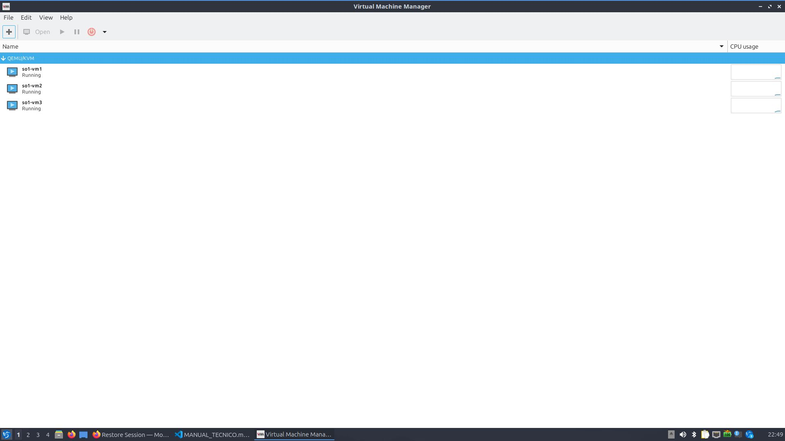
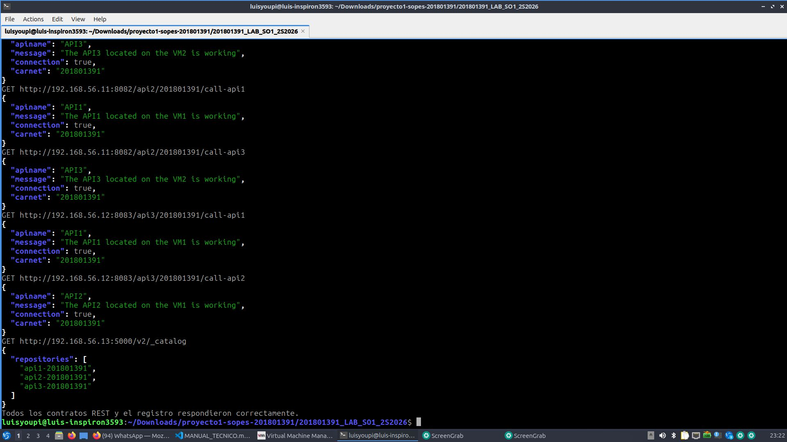
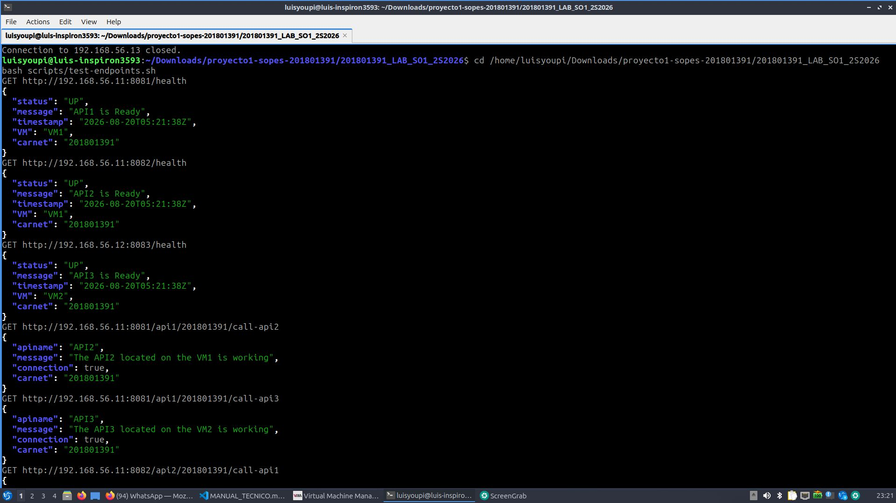
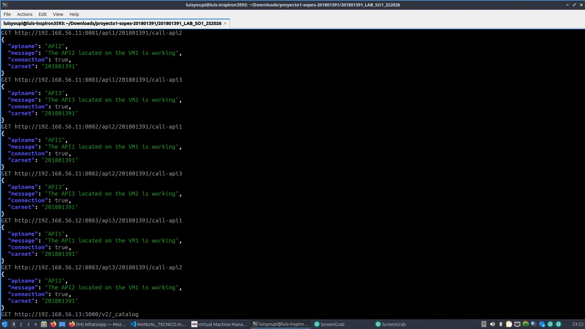
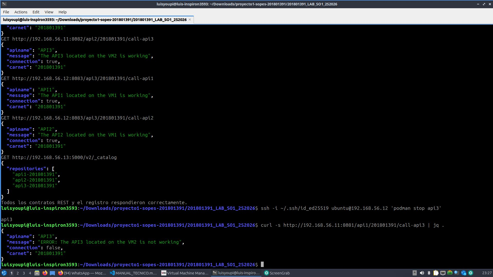
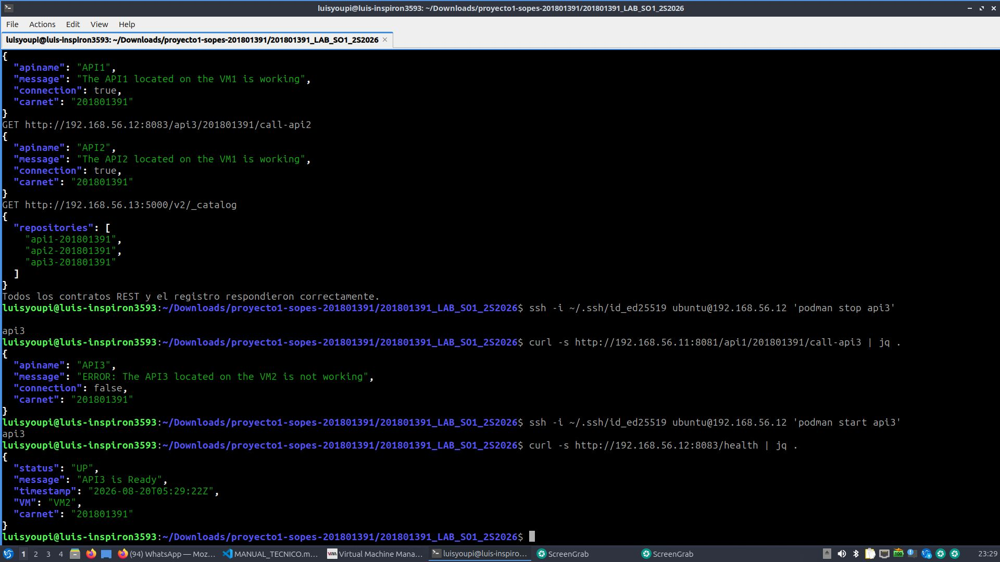

# Manual de usuario

## 1. Propósito

Este manual explica cómo iniciar, comprobar y apagar el laboratorio del Proyecto 1. El usuario interactúa con tres APIs REST y con el registro Zot desde una terminal Linux.

## 2. Servicios disponibles

| Servicio | Dirección | Función |
|---|---|---|
| API1 | `http://192.168.56.11:8081` | Salud y llamadas a API2/API3 |
| API2 | `http://192.168.56.11:8082` | Salud y llamadas a API1/API3 |
| API3 | `http://192.168.56.12:8083` | Salud y llamadas a API1/API2 |
| Zot | `http://192.168.56.13:5000` | Registro privado de imágenes |

## 3. Iniciar el laboratorio

1. Conecta el USB `SO1_VMS` y ábrelo desde el explorador de archivos.
2. No retires el USB mientras alguna VM esté encendida.
3. Si el equipo fue reiniciado, restaura el punto usado por libvirt:

```bash
sudo mkdir -p /mnt/so1-vms
sudo mount --bind /media/luisyoupi/SO1_VMS /mnt/so1-vms
```

4. Abre Virtual Machine Manager:

```bash
sg libvirt -c 'virt-manager --connect qemu:///system'
```

5. Enciende `so1-vm1`, `so1-vm2` y `so1-vm3` si alguna aparece apagada. Verifica desde otra terminal:

```bash
sg libvirt -c 'virsh -c qemu:///system list --all'
```

Las tres máquinas deben aparecer como `running`.



## 4. Comprobar el funcionamiento

Desde la raíz del proyecto ejecuta:

```bash
cd /home/luisyoupi/Downloads/proyecto1-sopes-201801391/201801391_LAB_SO1_2S2026
bash scripts/test-endpoints.sh
```

El script valida automáticamente los tres endpoints `/health`, las seis llamadas cruzadas y el catálogo Zot. La ejecución es satisfactoria cuando termina con:

```text
Todos los contratos REST y el registro respondieron correctamente.
```



## 5. Consultas individuales

### 5.1 Estado de cada API

```bash
curl -s http://192.168.56.11:8081/health | jq .
curl -s http://192.168.56.11:8082/health | jq .
curl -s http://192.168.56.12:8083/health | jq .
```

Cada respuesta debe incluir `status: "UP"`, la VM correspondiente y el carnet `201801391`.



### 5.2 Comunicación entre APIs

```bash
curl -s http://192.168.56.11:8081/api1/201801391/call-api2 | jq .
curl -s http://192.168.56.11:8081/api1/201801391/call-api3 | jq .
curl -s http://192.168.56.11:8082/api2/201801391/call-api1 | jq .
curl -s http://192.168.56.11:8082/api2/201801391/call-api3 | jq .
curl -s http://192.168.56.12:8083/api3/201801391/call-api1 | jq .
curl -s http://192.168.56.12:8083/api3/201801391/call-api2 | jq .
```

Una comunicación correcta contiene `connection: true`.



### 5.3 Catálogo de imágenes

```bash
curl -s http://192.168.56.13:5000/v2/_catalog | jq .
```

Debe listar `api1-201801391`, `api2-201801391` y `api3-201801391`.

## 6. Prueba de error y recuperación

Detén API3 temporalmente:

```bash
ssh -i ~/.ssh/id_ed25519 ubuntu@192.168.56.12 'podman stop api3'
curl -s http://192.168.56.11:8081/api1/201801391/call-api3 | jq .
```

La respuesta debe contener `connection: false` y un mensaje que inicia con `ERROR:`.



Restaura siempre API3 después de la prueba:

```bash
ssh -i ~/.ssh/id_ed25519 ubuntu@192.168.56.12 'podman start api3'
curl -s http://192.168.56.12:8083/health | jq .
```



## 7. Acceso administrativo a las VMs

```bash
ssh -i ~/.ssh/id_ed25519 ubuntu@192.168.56.11  # VM1
ssh -i ~/.ssh/id_ed25519 ubuntu@192.168.56.12  # VM2
ssh -i ~/.ssh/id_ed25519 ubuntu@192.168.56.13  # VM3
```

Para regresar al host ejecuta `exit`. No instales Docker en VM1 ni VM2 porque la separación de runtimes forma parte de la evaluación.

## 8. Apagar y retirar el USB

Apaga las VMs desde Virtual Machine Manager o desde el host:

```bash
sg libvirt -c 'virsh -c qemu:///system shutdown so1-vm1'
sg libvirt -c 'virsh -c qemu:///system shutdown so1-vm2'
sg libvirt -c 'virsh -c qemu:///system shutdown so1-vm3'
sg libvirt -c 'virsh -c qemu:///system list --all'
```

Espera hasta que las tres aparezcan como `shut off`. Después ejecuta:

```bash
sync
sudo umount /mnt/so1-vms
udisksctl unmount -b /dev/disk/by-label/SO1_VMS
```

Solo entonces es seguro desconectar físicamente el USB.
