# Evidencias de ejecución

## 1. Información de la prueba

| Campo | Valor |
|---|---|
| Proyecto | Telemetría y gestión autónoma de contenedores |
| Carnet | 201801391 |
| Sistema operativo | Ubuntu 22.04.5 LTS |
| Kernel | Linux 6.8.0-138-generic x86_64 |
| Fecha de ejecución | 23 y 24 de agosto de 2026 |
| Servicio | `so1-telemetryd.service` |
| Interfaz del módulo | `/proc/continfo_pr2_so1_201801391` |
| Exporter | `http://localhost:9105/metrics` |
| Prometheus | `http://localhost:9090` |
| Grafana | `http://localhost:3000` |

Las capturas fueron obtenidas durante una ejecución real en el host. Se conservan
completas, sin datos simulados, en [`capturas/`](evidencias/capturas/).

## 2. Observabilidad

### 2.1 Dashboard de Grafana

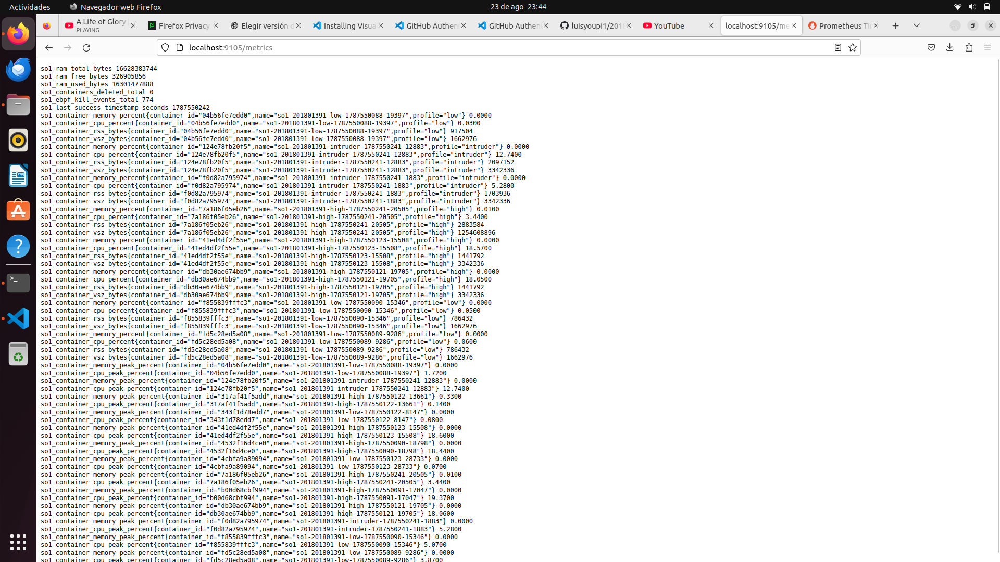

El dashboard presenta memoria total, libre y utilizada, el contador de eliminaciones,
eventos eBPF y la evolución temporal de RAM.


Los paneles históricos conservan contenedores que ya finalizaron y permiten comparar sus
máximos de RAM y CPU.

### 2.2 Prometheus y exporter


Prometheus alcanzó `host.docker.internal:9105/metrics`; el target
`so1-telemetry-201801391` aparece en estado **UP**.

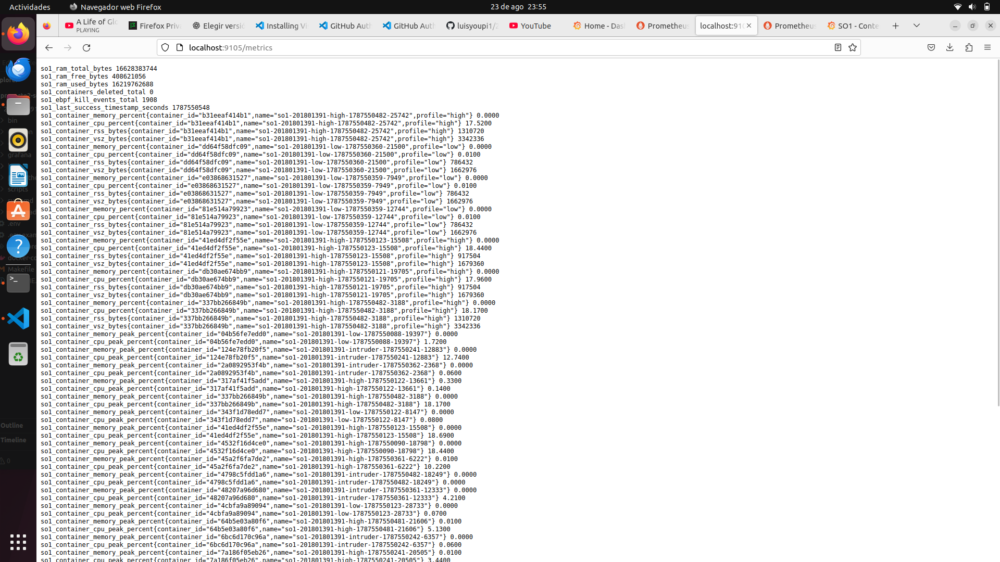

El exporter publica RAM, consumo actual e histórico por contenedor, eliminaciones y
llamadas `kill(2)` observadas por eBPF.

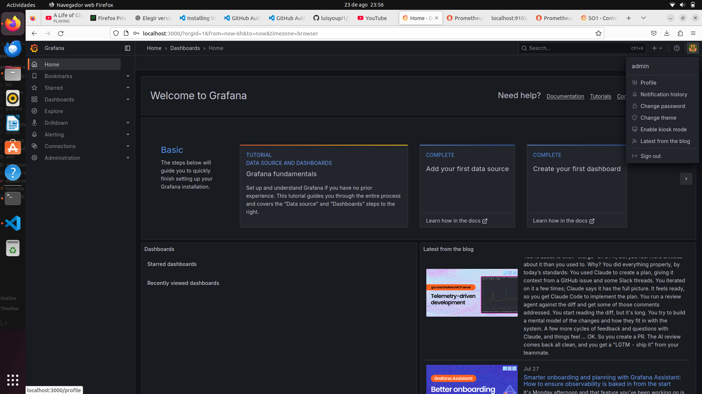

Grafana se inició con autenticación, datasource y dashboard provisionados.

## 3. Servicio y módulo del kernel

### 3.1 Daemon administrado por systemd


El journal demuestra que el daemon calcula una puntuación, clasifica el perfil y solicita
la detención de contenedores excedentes.

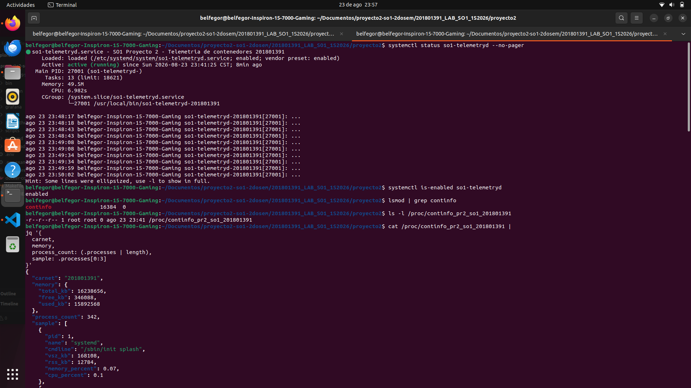

`so1-telemetryd.service` está `active (running)` y `enabled`.

### 3.2 Interfaz `/proc`


La salida incluye carnet, memoria total/libre/usada y, por proceso, PID, nombre, línea de
comando, VSZ, RSS y porcentajes de memoria y CPU.

### 3.3 Ciclo de carga y descarga

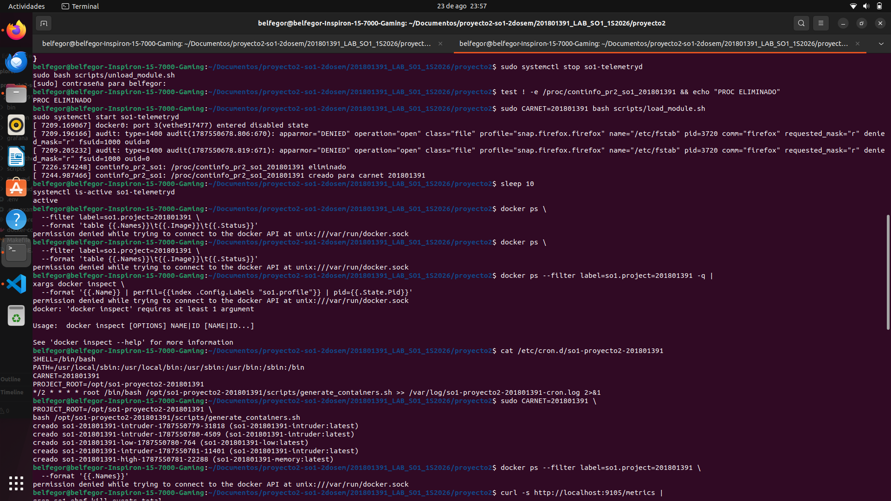

La prueba detiene el servicio, descarga `continfo`, verifica que `/proc` desapareció,
vuelve a cargar el módulo y confirma que el servicio regresa a `active`.

## 4. Automatización y eBPF

### 4.1 Cron y generación de carga

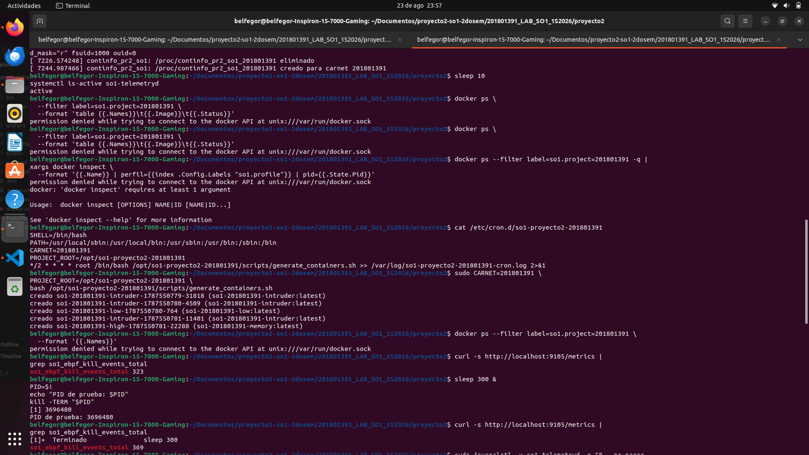

El cron programa una ejecución cada dos minutos. La invocación manual demuestra la
creación de cinco contenedores aleatorios y la restauración de la línea base.

### 4.2 Observación de `kill(2)`


La prueba crea un proceso `sleep`, envía `SIGTERM` y vuelve a consultar el exporter. El
incremento confirma que la sonda `syscalls:sys_enter_kill` recibió el evento.

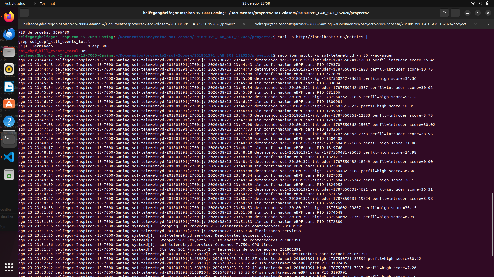

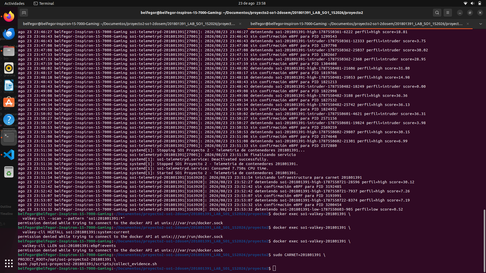

El journal permite auditar las decisiones tomadas durante varios ciclos de telemetría.

## 5. Hallazgos de la ejecución

### 5.1 Confirmación eBPF de eliminaciones

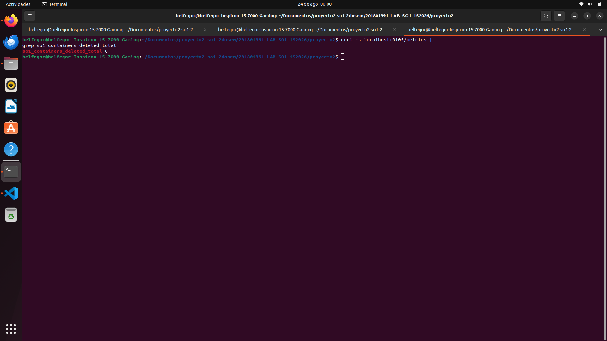

Durante esta corrida, `so1_containers_deleted_total` permaneció en cero aunque el daemon
detuvo excedentes. El journal registra `sin confirmación eBPF para PID ...`: Docker puede
usar una ruta de señalización diferente de `kill(2)` o el PID puede finalizar antes de la
correlación. Por diseño conservador, una detención sin confirmación no se contabiliza como
eliminación eBPF confirmada.

### 5.2 Permisos del socket de Docker

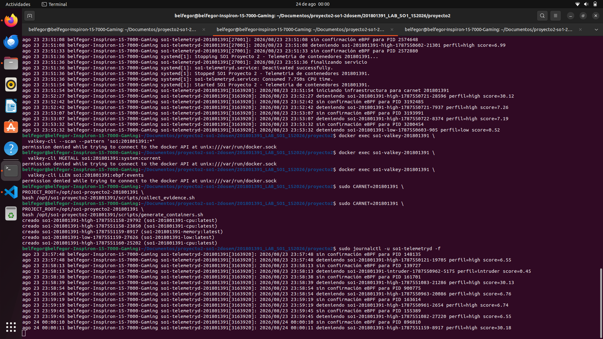

La sesión gráfica no había recargado el grupo `docker`, por lo que los comandos del
usuario mostraron `permission denied`. El servicio no fue afectado porque corre como
`root`. Para la defensa se debe volver a iniciar sesión, ejecutar `newgrp docker` o usar
`sudo docker`.

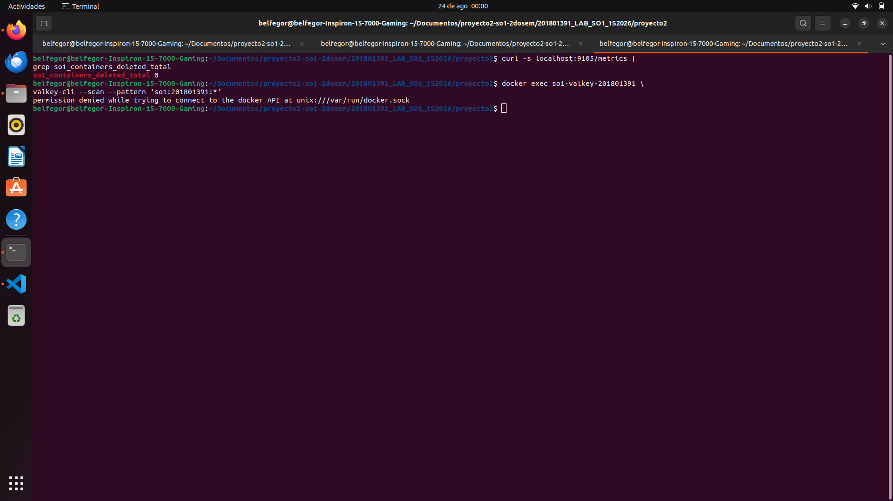

La última captura confirma que el daemon continuó generando y evaluando contenedores.

## 6. Lista de comprobación

- [x] Servicio activo y habilitado en systemd.
- [x] Módulo `continfo` cargado, descargado y recargado.
- [x] JSON válido en `/proc/continfo_pr2_so1_201801391`.
- [x] Cron instalado con periodicidad de dos minutos.
- [x] Generación de cinco contenedores aleatorios.
- [x] Línea base de tres perfiles `low` y dos perfiles `high`.
- [x] Exporter disponible en el puerto 9105.
- [x] Target de Prometheus en estado `UP`.
- [x] Dashboard con RAM, Top 5 y eBPF.
- [x] Incremento eBPF mediante una señal controlada.
- [x] Logs de clasificación y detención del daemon.
- [ ] Confirmación eBPF de una eliminación iniciada por Docker; documentada como
  limitación observada.

## 7. Evidencia reproducible

```bash
sudo CARNET=201801391 \
  PROJECT_ROOT=/opt/so1-proyecto2-201801391 \
  bash /opt/so1-proyecto2-201801391/scripts/collect_evidence.sh
```

El script conserva kernel, módulo, snapshot de `/proc`, contenedores, métricas, claves de
Valkey, journal y salud de Grafana. Las capturas se mantienen adicionalmente porque
documentan el resultado visual.
