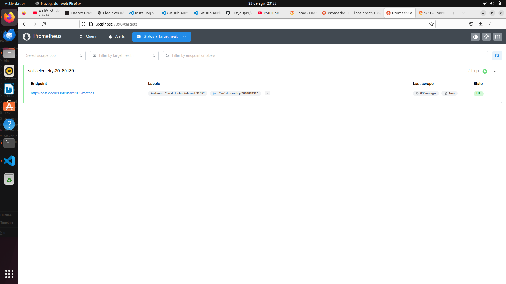
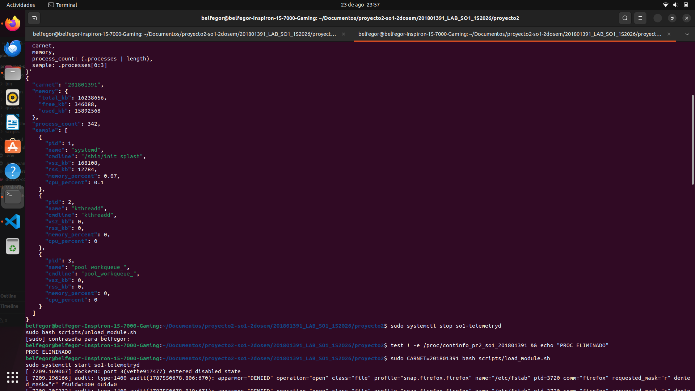
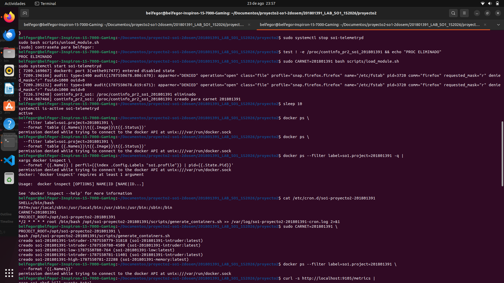
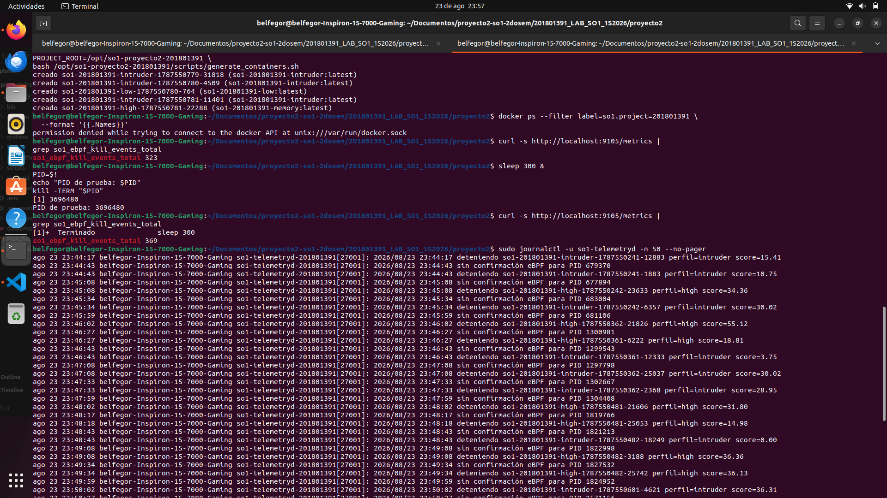
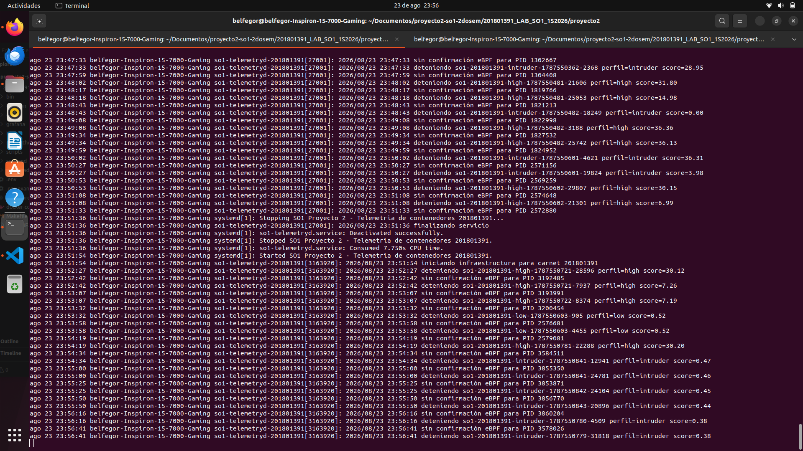
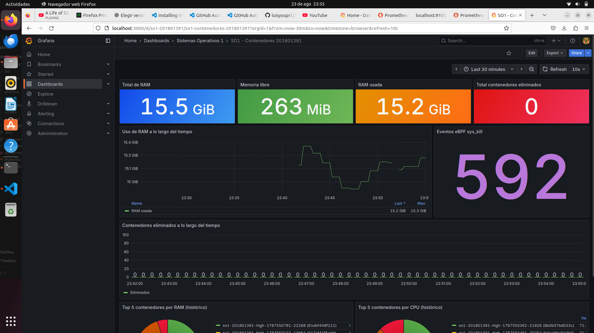
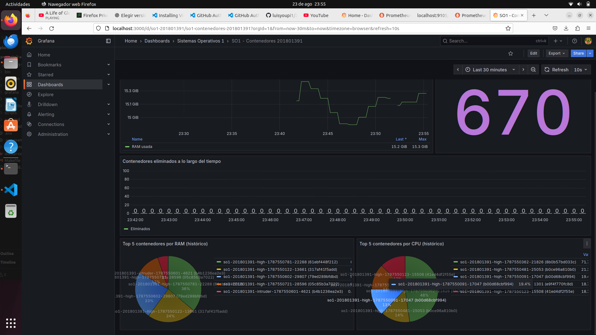

# Manual técnico

## 1. Datos generales

- Proyecto: Sonda de Kernel en C y Daemon en Go para telemetría de contenedores
- Carnet: 201801391
- Curso: Sistemas Operativos 1
- Interfaz `/proc`: `/proc/continfo_pr2_so1_201801391`
- Intervalo del daemon: 30 segundos, configurable entre 20 y 60 segundos
- Cron de carga: cada 2 minutos

## 2. Arquitectura

```mermaid
flowchart LR
    K[Kernel Linux] -->|task_struct, sysinfo| M[Módulo continfo.ko]
    M -->|JSON| P[/proc/continfo_pr2_so1_201801391]
    P --> G[Daemon Go]
    D[Docker Engine] --> G
    C[Cron cada 2 min] --> D
    G -->|stop/rm| D
    G -->|métricas y eventos| V[(Valkey)]
    G -->|/metrics :9105| R[Prometheus]
    R --> F[Grafana]
    B[eBPF sys_enter_kill] -->|ring buffer| G
    D -->|kill PID| B
```

El daemon corre como `root` en el host porque necesita cargar el módulo, adjuntar eBPF,
leer cgroups y administrar Docker. Valkey, Prometheus y Grafana se ejecutan como
contenedores. Esta separación evita otorgar privilegios innecesarios al dashboard.

### 2.1 Arquitectura desplegada



La captura confirma el recorrido operativo `daemon → exporter → Prometheus`. El target
`so1-telemetry-201801391` se encuentra en estado `UP` y apunta al puerto 9105 del host.

## 3. Módulo de kernel

### 3.1 Creación de `/proc`

`kernel/continfo.c` usa `proc_create`, `single_open` y `seq_file`. La interfaz `seq_file`
permite producir una salida mayor que una página sin administrar manualmente offsets o
buffers parciales. La documentación oficial está en
<https://docs.kernel.org/filesystems/seq_file.html>.

Al cargar el módulo se crea un archivo de solo lectura:

```text
/proc/continfo_pr2_so1_201801391
```

Al descargarlo, `proc_remove` elimina la entrada.

### 3.2 Captura segura de procesos

El módulo recorre `task_struct` bajo RCU únicamente para copiar PIDs a un arreglo. Luego
libera RCU y obtiene referencias independientes mediante `find_get_pid` y `get_pid_task`.
Esto evita mantener el bloqueo RCU mientras se consulta la línea de comandos o el mapa de
memoria.

Por cada proceso se obtiene:

- PID y nombre (`get_task_comm`);
- línea de comando mediante `mm->arg_start`, `mm->arg_end` y
  `access_process_vm`; esto evita depender de `get_cmdline`, que no se exporta a módulos
  externos en el kernel 6.8 usado durante la validación;
- VSZ mediante `mm->total_vm`;
- RSS mediante `get_mm_rss`;
- porcentaje de RAM sobre la memoria total;
- CPU acumulada mediante `task_cputime_adjusted`, normalizada por el tiempo de vida.

La salida usa escape JSON para comillas, barras y caracteres de control.

### 3.3 Evidencia de procfs





La evidencia confirma que el contrato puede procesarse con `jq` y que la lista supera
una página, lo cual justifica el uso de `seq_file`.

### 3.4 Contrato JSON

```json
{
  "carnet": "201801391",
  "memory": {"total_kb": 16384000, "free_kb": 5000000, "used_kb": 11384000},
  "processes": [
    {
      "pid": 1200,
      "name": "memory-workload",
      "cmdline": "/usr/local/bin/memory-workload",
      "vsz_kb": 250000,
      "rss_kb": 130000,
      "memory_percent": 0.79,
      "cpu_percent": 1.25
    }
  ]
}
```

## 4. Sonda eBPF

`kill_monitor.bpf.c` se adjunta al tracepoint `syscalls:sys_enter_kill`. Cada evento
reserva una entrada en un mapa `BPF_MAP_TYPE_RINGBUF`, valida que la reserva no sea nula
y envía:

- PID emisor;
- PID receptor;
- señal;
- marca monotónica del kernel;
- nombre del proceso emisor.

El daemon carga el ELF con `cilium/ebpf`, adjunta el tracepoint y consume el ring buffer.
Antes de detener un contenedor registra su PID principal como esperado. Una eliminación
solo incrementa `deleted:total` cuando llega un evento eBPF para ese PID. La biblioteca y
el patrón ring buffer se documentan en <https://github.com/cilium/ebpf>.

### 4.1 Evidencia de eventos



La comparación antes y después de enviar `SIGTERM` a un proceso controlado demuestra que
la sonda recibe eventos reales del kernel.

## 5. Daemon en Go

### 5.1 Inicio

1. Levanta Valkey, Prometheus y Grafana con Docker Compose.
2. Construye las cuatro imágenes de carga.
3. Carga `continfo.ko`.
4. Instala `/etc/cron.d/so1-proyecto2-201801391`.
5. Crea la línea base de 3 contenedores bajos y 2 altos.
6. Conecta Valkey y adjunta eBPF.
7. Publica `/metrics` en el puerto 9105.

### 5.2 Ciclo principal

Cada 30 segundos:

1. Deserializa el JSON de `/proc`.
2. Obtiene contenedores con etiqueta `so1.project=201801391`.
3. Relaciona cada proceso con su contenedor leyendo `/proc/<pid>/cgroup`.
4. Agrega VSZ, RSS, RAM y CPU de todos los procesos del cgroup.
5. Guarda la instantánea en Valkey.
6. Ordena por una puntuación compuesta:

```text
score = RAM% * 0.35 + CPU% * 0.35 + VSZ_normalizado * 0.15 + RSS_normalizado * 0.15
```

7. Elimina primero intrusos y después excedentes, manteniendo como mínimo 3 bajos y 2
   altos.
8. Espera confirmación eBPF antes de registrar la eliminación.
9. Restaura la línea base si algún contenedor terminó por tiempo.

El daemon nunca selecciona Grafana, Prometheus o Valkey porque solo administra recursos
con la etiqueta del proyecto.

### 5.3 Evidencia de decisiones



El journal registra el nombre, perfil y puntuación del contenedor elegido, proporcionando
trazabilidad sobre cada decisión automatizada.

### 5.4 Finalización

`signal.NotifyContext` captura `SIGTERM` y `SIGINT`. Al salir, el daemon cierra el ring
buffer, la conexión a Valkey, el servidor HTTP y elimina el cron para evitar sobrecarga.

## 6. Persistencia en Valkey

Prefijo: `so1:201801391`.

| Clave | Tipo | Uso |
|---|---|---|
| `system:current` | hash | RAM actual y timestamp |
| `series:ram_*` | sorted set | evolución temporal |
| `containers:current` | hash | contenedores activos |
| `containers:history` | hash | último máximo conocido, incluso eliminado |
| `ebpf:events` | list | eventos reales de `kill(2)` |
| `deleted:total` | string | contador confirmado |
| `series:deletions` | sorted set | historial de eliminaciones |

Valkey es la fuente persistente. El endpoint Prometheus expone una proyección de las
mismas instantáneas para simplificar las visualizaciones de Grafana.

## 7. Cargas Docker

- `memory`: programa Go que reserva hasta 128 MiB gradualmente.
- `cpu`: Alpine y `bc` en un ciclo limitado a 240 segundos.
- `low`: Alpine dormido por 240 segundos.
- `intruder`: usuario sin privilegios que intenta leer rutas sensibles sin montar el host.

Todos llevan límites de CPU/RAM y `--rm` para impedir acumulación de contenedores
detenidos.

## 8. Dashboard

El JSON provisionado incluye exactamente las métricas solicitadas:

- total, libre y usada de RAM;
- RAM a lo largo del tiempo;
- eliminaciones totales y por intervalo;
- Top 5 histórico por RAM y CPU;
- contador de eventos eBPF.

### 8.1 Resultado visual





El primer panel resume el estado del host y los eventos del kernel; el segundo permite
analizar los máximos históricos de los contenedores administrados.

## 9. Decisiones y limitaciones

- CPU es un promedio acumulado de vida del proceso, no una muestra diferencial entre dos
  lecturas. Es estable y suficiente para ordenar; el enunciado permite valores altos.
- El tracepoint elegido audita `kill(2)`. Si una versión de Docker cambia a
  `pidfd_send_signal`, se debe añadir un segundo programa eBPF equivalente.
- Compilar el módulo contra un kernel y cargarlo en otro no está soportado; debe repetirse
  `make kernel` después de actualizar el kernel.
- El proyecto requiere BTF en `/sys/kernel/btf/vmlinux` para compilar CO-RE.
- El contador `deleted:total` solo aumenta si el evento eBPF coincide con el PID principal
  esperado. Si Docker usa otra ruta de señalización, la detención ocurre pero queda como
  no confirmada y el journal registra el timeout.
- Los comandos Docker interactivos requieren recargar la membresía del grupo `docker`.
  El servicio systemd no tiene esta restricción porque se ejecuta como `root`.

## 10. Estructura

```text
proyecto2/
├── kernel/                 módulo y Kbuild
├── daemon/                 servicio Go y sonda eBPF
├── workloads/              cuatro imágenes de prueba
├── scripts/                carga, cron, instalación y evidencias
├── grafana/                provisión y dashboard
├── prometheus/             configuración de scrape
├── systemd/                unidad del daemon
├── docs/                   manuales y defensa
├── docker-compose.yml
└── Makefile
```

## 11. Validación funcional realizada

La solución fue validada en Ubuntu 22.04.5 LTS con kernel 6.8.0-138-generic. La prueba
cubrió compilación, pruebas unitarias, instalación systemd, carga y descarga del módulo,
JSON de procfs, contenedores de los tres perfiles, persistencia, scrape de Prometheus,
dashboard de Grafana y una señal `SIGTERM` observada por eBPF.

Las capturas y el análisis están en [`docs/evidencias.md`](evidencias.md). Se incluyen
resultados exitosos e incidencias para mantener una entrega auditable y reproducible.

## 12. Secuencia de demostración

```bash
systemctl status so1-telemetryd --no-pager
lsmod | grep continfo
cat /proc/continfo_pr2_so1_201801391 | jq \
  '{carnet, memory, process_count:(.processes|length), sample:.processes[0:3]}'
sudo docker ps --filter label=so1.project=201801391
cat /etc/cron.d/so1-proyecto2-201801391
curl -fsS http://localhost:9105/metrics | grep '^so1_'
```

Después se comprueba `http://localhost:9090/targets` y el dashboard en
`http://localhost:3000`. La sonda eBPF se demuestra con:

```bash
curl -s localhost:9105/metrics | grep so1_ebpf_kill_events_total
sleep 300 & PID=$!
kill -TERM "$PID"
curl -s localhost:9105/metrics | grep so1_ebpf_kill_events_total
```
